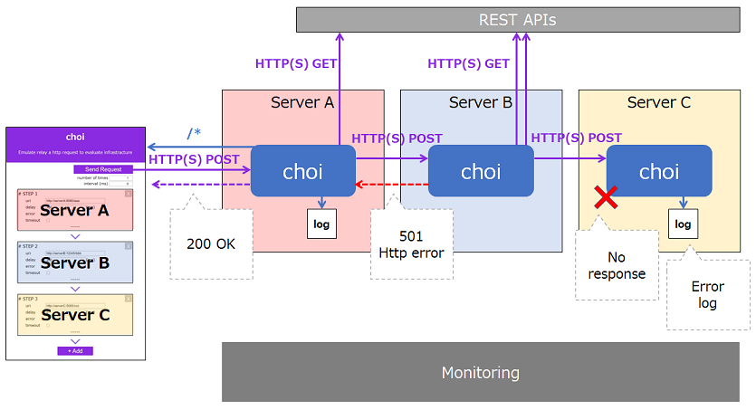

## choi

The purpose of this application is that to evaluate your infrastracture such like cloud-VMs, containers and k8s.
It's easy to deploy cloud infrastraucre but it's still necesarry to prepare application or middleware to check operations or network on the infrastracture.

choi is a super simple web-application using vuejs and node-express and this app can easily relay http request like below.



## how to use

1. install nodejs on your server/container
2. clone this repository
3. yarn install
4. yarn start

then you can access a choi page at this server (http://localhost:3000) , any path available /*

if you want to change PORT, please note your PORT in .env file
````
PORT=5000
````

### sample dockerfile (just sample, using git clone in dockerfile...)
````
FROM node:14-alpine

# install Git & Bash
RUN apk update && apk add git && apk add bash

# get choi
RUN git clone https://github.com/shyamagu/choi.git

WORKDIR /choi

# yarn install
RUN yarn install

EXPOSE 3000

CMD ["yarn","start"]
````

### for Windows user

- Don't forget to open port at Firewall security

